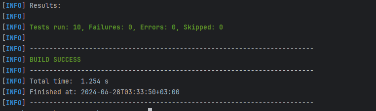

**HTTP Server**
- Do not use external libraries
- Implement part of HTTP 1.1 protocol using ServerSocketChannel (java.nio)
- Methods:
    - GET
    - POST
    - PUT
    - PATCH
    - Delete
- Headers (should be accesible as Map)
- Body
    - Bonus: multipart form data
- Your library should support:
    - Create and httpserver on specified host+port
    - Add listener to specific path and method
    - Access to request parameters (headers, method, etc)
    - Create and send http response back
****************
**Library description**\
\
*HTTPServer library is a lightweight Java framework that enables the implementation of an HTTP server supporting various HTTP methods (GET, POST, PUT, PATCH, DELETE). Here's a concise description:*
- HTTPServer Class: 
  - Creates an HTTP server on a specified host and port using ServerSocketChannel from java.nio.
  - Registers handlers for specific HTTP methods (GET, POST, PUT, PATCH, DELETE) and paths using a Map.
  - Accepts incoming client connections and delegates handling to registered handlers.
- HTTPHandler Interface:
    - Defines a contract (handle method) for handling HTTP requests and generating HTTP responses.
- HTTPRequest Class:
    - Parses incoming raw HTTP requests to extract method, path, headers, and body.
    - Provides methods to access parsed request details (getMethod, getPath, getHeaders, getBody).
- HTTPResponse Class:
  - Constructs HTTP responses with status codes, headers, and response bodies.
  - Provides methods to set status code (setStatusCode), response body (setBody), and add headers (addHeader).
  - Converts the response to a string format suitable for transmission over the network (toString).
    HTTP Methods Supported:

- GETHandler: Handles GET requests.
- POSTHandler: Handles POST requests, including processing of request bodies.
- PUTHandler: Handles PUT requests.
- PATCHHandler: Handles PATCH requests.
- DELETEHandler: Handles DELETE requests.
************

**Test description**\
\
*The HTTPServerTest class is a JUnit test suite designed to verify the functionality of the HTTPServer and its handlers using unit tests. Here's a concise description of what the test suite does:*
- HTTPServerTest: This file tests the functionality of the HTTPServer class. It includes setup and teardown methods to start and stop the server. It tests the server's ability to handle a simple GET request, ensuring the server responds with the correct status code (200 OK).
- HTTPResponseTest: This file tests the HTTPResponse class. It includes tests for setting the status code, setting the body of the response, and adding headers. The tests verify that the response is correctly formatted as a string.
- HTTPRequestTest: This file tests the HTTPRequest class. It includes tests for parsing a raw HTTP request string. The tests check that the method, path, and headers are correctly extracted from the raw request.
- HTTPHandlersTest: This file tests the HTTP handlers (GETHandler, POSTHandler, PUTHandler, PATCHHandler, DELETEHandler). Each handler is tested with a corresponding HTTP request to ensure they handle requests correctly and produce the expected responses (status code, body, and headers).

**Maven test result**

