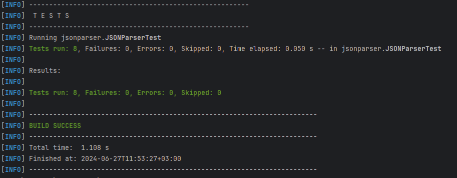

**JSON parser**

- Do not use external libraries
- Read JSON string
    - To Java Object
    - To Map<String, Object>
    - *To specified class*
- Convert Java object to JSON string
- Library should support
    - Classes with fields (primitives, boxing types, null, arrays, classes)
    - Arrays
    - Collections
- Limitations (you may skip implementation)
    - Cyclic dependencies
    - non-representable in JSON types
*********
**Library description**\
*The JSONParser library provides functionality to parse JSON strings into Java objects and vice versa without relying on external libraries. It includes methods to handle JSON objects, arrays, and scalar values such as strings, numbers, booleans, and null values.*
- JSONParser Class:
  - parse(String json): Parses a JSON string into a Map<String, Object>, representing key-value pairs of JSON objects.
  - fromJson(String json, Class<T> clazz): Converts a JSON string into a Java object of a specified class (clazz). Supports arrays, lists, and complex objects.
  - toJson(Object obj): Converts a Java object into a JSON string representation.
    JSONTokenizer Class:

- SONTokenizer Class:
  - Tokenizes a JSON string into individual tokens such as strings, numbers, booleans, object and array delimiters ({}, []), and punctuation (:, ,).

- Functionality:
  - Supports parsing and conversion of JSON objects, arrays, and scalar values.
  - Handles nested structures and supports generic types for arrays and lists.
  - Ensures robust error handling for unexpected JSON formats and types.
  - Provides methods for converting Java objects into JSON strings, accommodating various data types.

*********
**Test description**\
The JSONParserTest class contains JUnit tests for validating the functionality of the JSONParser library, which provides methods to parse JSON strings into Java objects and convert Java objects back into JSON format. It ensures that the parsing and serialization processes are accurate and handle various data types correctly.

**Maven test result**

